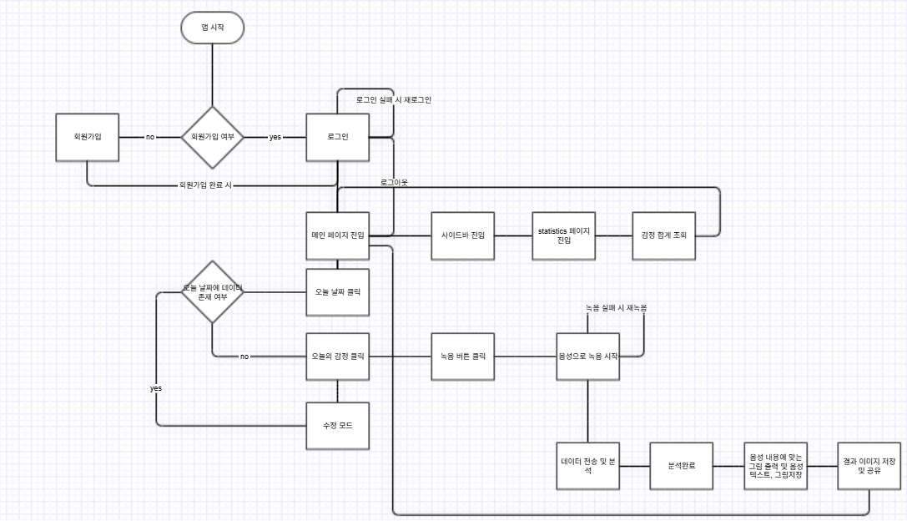

# DODLE APP
사용자의 음성을 통해 텍스트, 이미지화시켜 저장 및 공유하는 감정 다이어리 앱

### 서비스 플로우 차트
사용자의 감정 기록 여정에 따른 시스템의 판단 로직과 데이터 흐름을 설계

- **main flow** 감정선택 -> 음성 녹음 -> AI 분석 -> 결과 저장 및 공유
- **sub flow** 사이드바를 통한 감정 통계 조회 및 대시보드 제공

